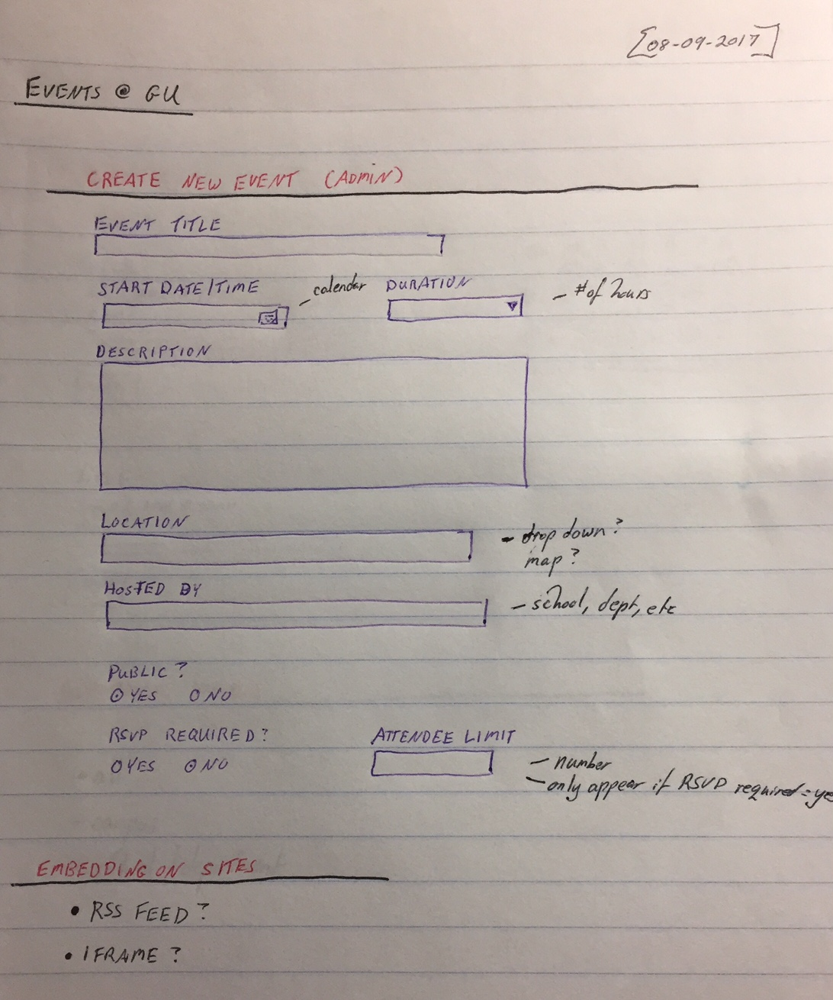
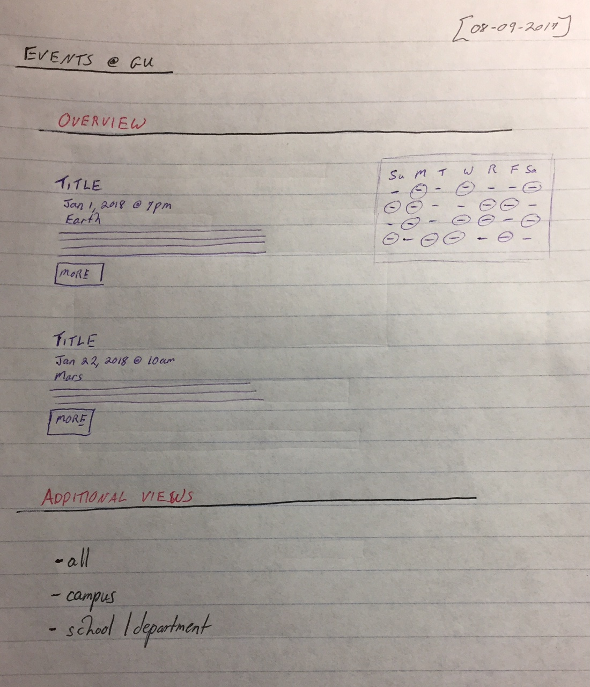

# Drupal 8 Events Manager

This JS app is a proof of concept for an events manager using Drupal 8 as a backend.

## Events content type

This app requires uses an "Events" content type.  Here's the setup:

| Field label | Machine name | Field type
| ------- | ------- | -------
| Attendee Limit | field_attendee_limit | Number (integer)
| End Date | field_end_date | Date
| Event Details	| body | Text (formatted, long, with summary)
| Hosted by	| field_organizations | Entity reference
| Location | field_location | Entity reference
| Public Event | field_public_event | Boolean
| RSVP Required	| field_rsvp_required | Boolean
| Start Date | field_date | Date

## Relevant taxonomies

There are two "Entity reference" fields in the Events content type.  This is because the "Hosted by" and "Location" fields are populated by taxonomy terms.

### Organizations taxonomy

The "Hosted by" field uses the __Organizations__ taxonomy, which is a list of schools, departments, and other organizations.	It includes one custom field:

| Field label | Machine name | Field type
| ------- | ------- | -------
| Organization type | field_organization_type | List (text)

The current values for the _Organization type_ field are:

* School
* Unit
* Organization
* Campus

### Locations taxonomy
The "Location" field uses the __Locations__ taxonomy, which is is a list of locations where events can be held.  It includes one custom field:

| Field label | Machine name | Field type
| ------- | ------- | -------
| Address | field_address | Text (plain)

## Events JSON export View

This app also requires a custom view, which allows Drupal to return the data from the Events content type as a JSON object.  A few customizations of note:

* The __Show__ Format has been set to "Fields".
* The __Path__ has been set to `"/eventsexportall"`.
* The __Sort Criteria__ has been set to "Content: Start Date (asc)".
* The __Pager__ has been set to "Display all items".  _(I may come to regret this later.)_

The fields being exposed in this view are:

| Field | Formatter
| ------- | -------
| Content: Title | Plain text
| Content: Attendee Limit | Default
| Content: Body | value
| Content: Hosted by | Label
| Content: Location | Label
| Content: Path |
| Content: Public Event | Boolean (yes/no)
| Content: Publishing status | Boolean (true/false)
| Content: RSVP Required | Boolean (yes/no)
| Content: End Date | Custom (Y-m-d\TH:i:s)
| Content: Start Date | Custom (Y-m-d\TH:i:s)

## Wireframes

### Admin screen wireframe

### User-facing view wireframe

